# Creating a New Project

In this section we'll create a new Godot project, set up `godot-bevy` in it, create our first Bevy entities, build our first scene using the entity-generated nodes, instantiate that scene from a Bevy system, and control our first node.

## 1. Create a New Godot Project

In this step, we'll create a new Godot project to use for this guide. Make sure you meet the [system requirements](./index.md#system-requirements), then follow these steps:

1. **Open** Godot
2. Click **Create**

View screenshot

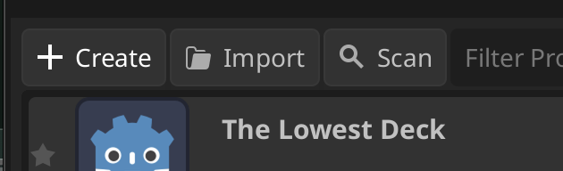

3. Fill in your project details and **Create** your project

View screenshot

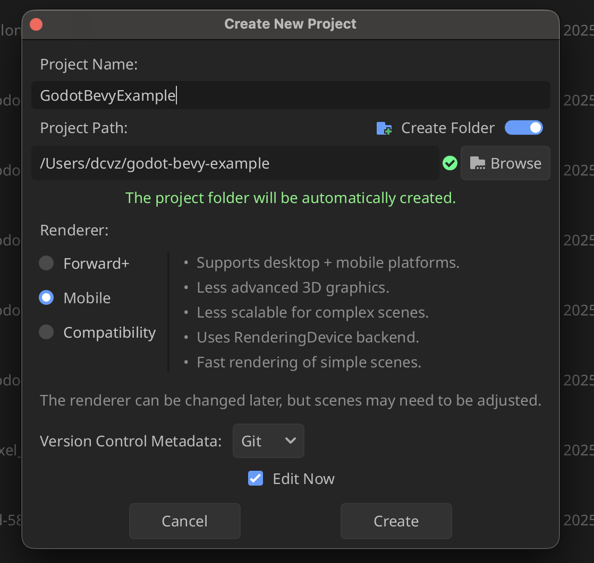

## 2. Install the Godot Editor Plugin

Next we'll install `godot-bevy`'s Godot Editor Plugin. The plugin has a project creation wizard which will make things a ton easier for us!

1. **Download** a zip of the [release](https://github.com/bytemeadow/godot-bevy/releases) associated with the version.

View screenshot

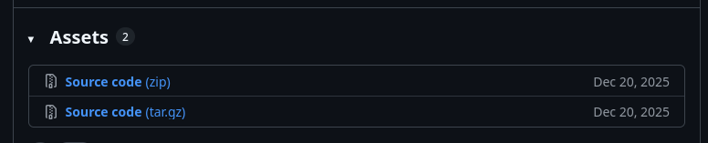

2. **Extract and Copy** the `godot-bevy` plugin to your project's `/addons` folder from the zipped release you downloaded in the previous step. You can find the plugin at `godot-bevy-<x.y.z version>/addons/godot-bevy`.

View screenshot

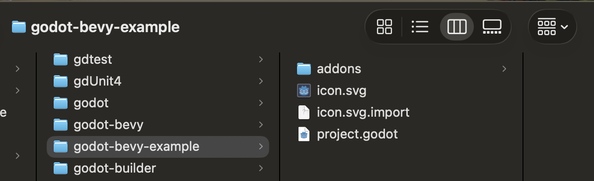

3. **Open** Project > Project settings and navigate to the Plugins tab.

View screenshot

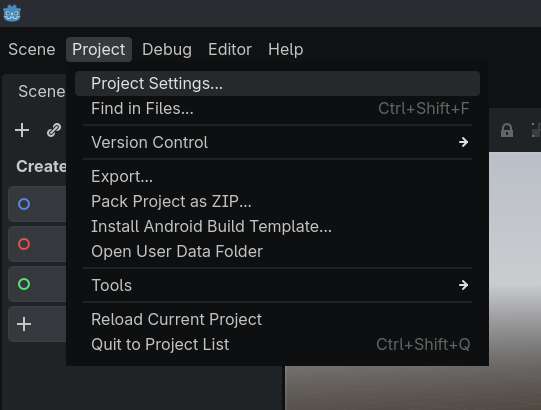

4. **Enable** godot-bevy

View screenshot

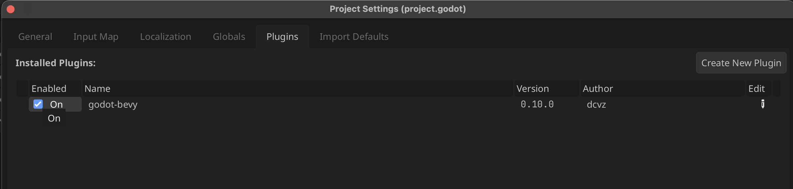

## Generate the `godot-bevy` Project

Next we'll create the Bevy rust project via our Godot Editor Plugin's > Tools functionality. This will create the basic Bevy boilerplate code for us as well as the `rust.gdextension` file to link it to Godot.

1. **Open** Project > Tools > Setup `godot-bevy` project

View screenshot

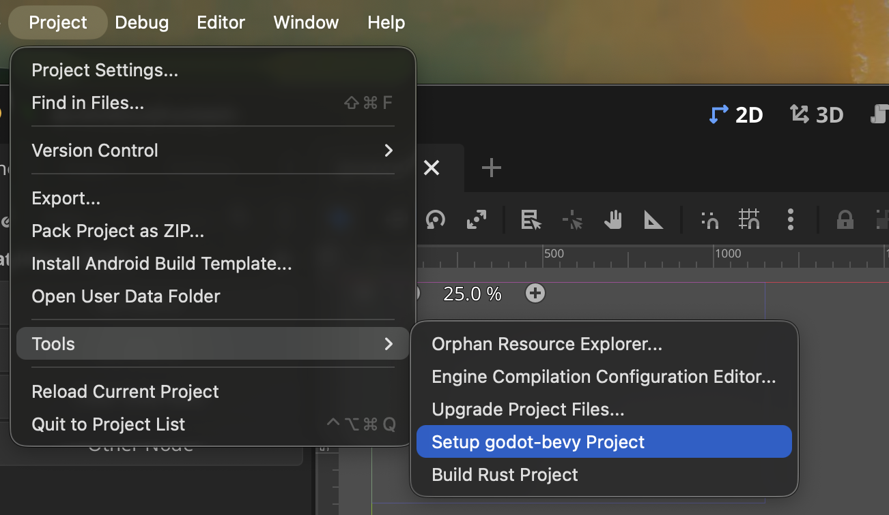

2. Fill in project details and **Create Project**. This starts a background process to generate the rust code for the bevy project _(will take a moment)_.

View screenshot

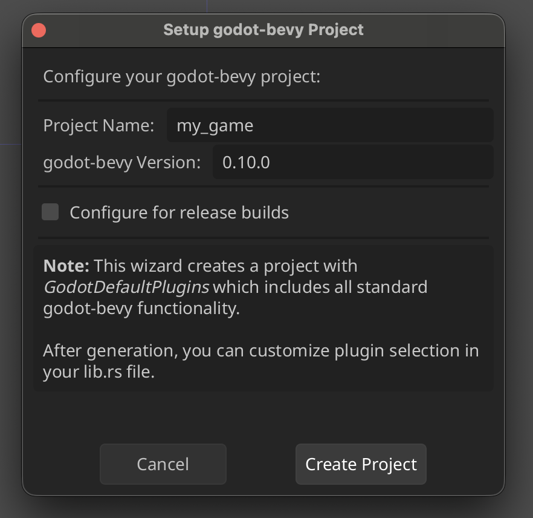

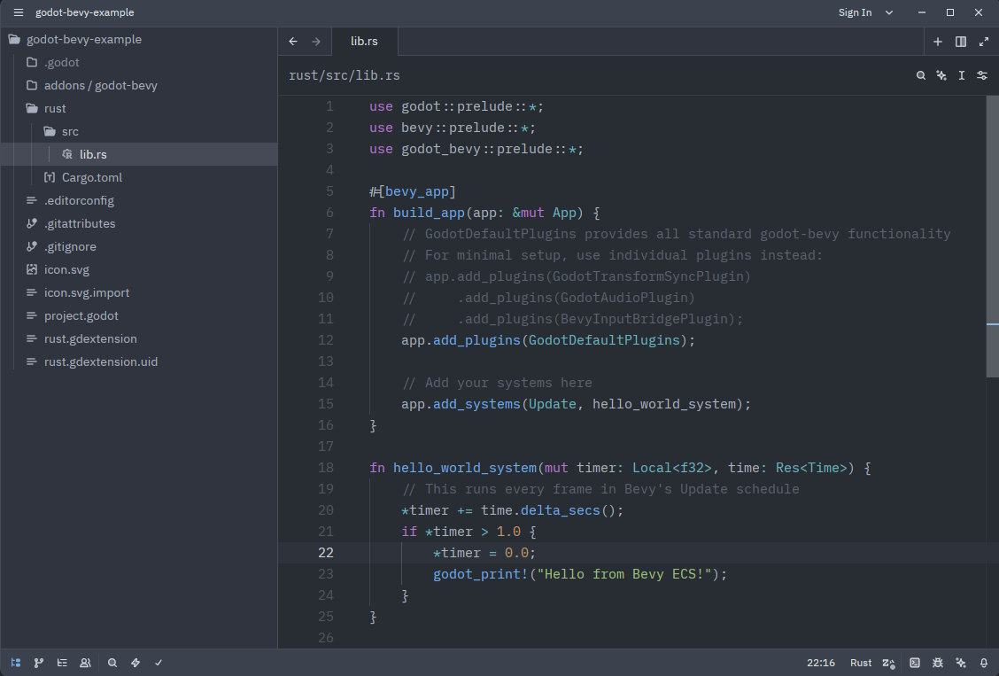

## Creating a scene

1. **Create** a new  3D scene node and rename it to "Main" by double clicking it. 

View screenshot

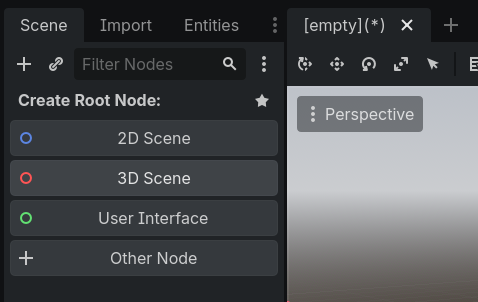

2. Set this to the project's main scene by opening Project -> Project Settings -> General -> Application -> Run. You can also press `f5` and a prompt will appear, allowing you to select the current scene as the main one.

View screenshot

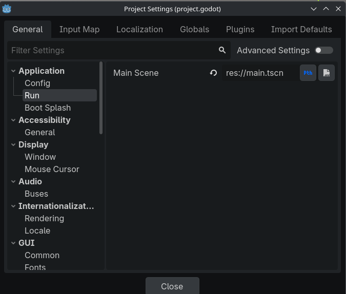
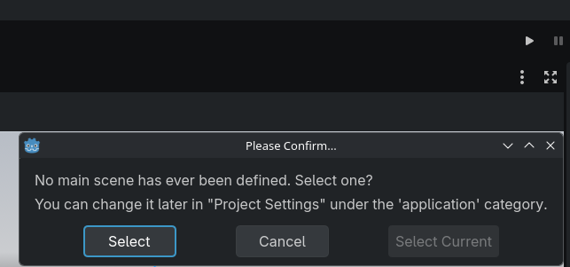

3. Run the project and check out the output window to see a message from the Bevy application printed every second.
