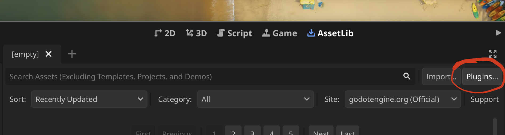

# Creating a New Project

In this section we'll create a new Godot project, set up `godot-bevy` in it, create our first Bevy entities, build our first scene using the entity-generated nodes, instantiate that scene from a Bevy system, and control our first node.

## 1. Create a New Godot Project

In this step, we'll create a new Godot project to use for this guide. Make sure you meet the [system requirements](./index.md#system-requirements), then follow these steps:

1. **Open** Godot
2. Click **Create**

View screenshot

3. Fill in your project details and **Create** your project

View screenshot

## 2. Install the Godot Editor Plugin

Next we'll install `godot-bevy`'s Godot Editor Plugin. The plugin has a project creation wizard which will make things a ton easier for us!

1. **Download** the `addons/godot-bevy` folder from our [repository](https://github.com/bytemeadow/godot-bevy)
2. **Copy** it to your project's folder

View screenshot

3. **Open** Plugins via the AssetLib Section

View screenshot

4. **Enable** godot-bevy

View screenshot

## Generate the `godot-bevy` Project

Next we'll create the rust project via our Godot Editor Plugin's > Tools functionality.

1. **Open** Project > Tools > Setup `godot-bevy` project

View screenshot

2. Fill in project details and **Create Project** (will take a moment)

View screenshot

