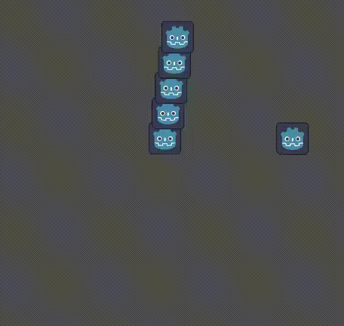

# Simple Node2D Movement

This example moves a Sprite2D in a circle. Bevy systems attach components to the sprite's entity, read `Res<Time>` in `Update`, and change its `Transform`. `GodotTransformSyncPlugin` copies those changes to Godot.



## Running this example

From the repository root, with Godot on your `PATH`:

```bash
cargo run --manifest-path examples/simple-node2d-movement/rust/Cargo.toml
```

The launcher builds the library, generates its GDExtension descriptor, and opens Godot.

The web build is blocked on [#268](https://github.com/bytemeadow/godot-bevy/issues/268). The `web` and `web-nothreads` features remain available for development, but web CI is disabled.
